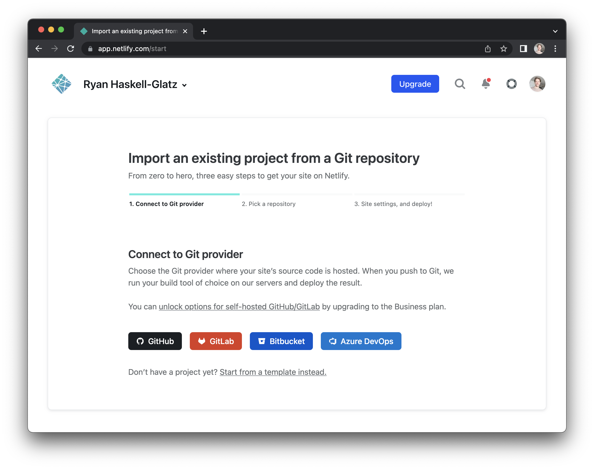

# Deploying to production

### What we'll learn

- How to __build your app__ in production mode
- How to __handle SPA redirects__ for 404 pages
- How to connect __GitHub with Netlify__ for continuous deployment

## Building your app

When you are ready to publish your Elm Land app, you can use the `elm-land build` command. The build command will handle building, optimizing, and minifying your app for production.

```sh
elm-land build
```

```txt

🌈  Elm Land successfully built your project at ./dist
    ⎺⎺⎺⎺⎺⎺⎺⎺⎺⎺⎺⎺⎺⎺⎺⎺⎺⎺⎺⎺⎺⎺⎺⎺⎺⎺⎺⎺⎺⎺⎺⎺⎺⎺⎺⎺⎺⎺⎺⎺⎺⎺⎺⎺⎺⎺⎺⎺⎺⎺
```


If the Elm compiler detects _any_ problems, they will be reported as friendly messages in your terminal.

### Understanding the output

All Elm Land apps are compiled as "single-page applications" in the `dist` folder. This means no matter what page is requested, that request will need to be directed to a single file: `dist/index.html`.

Depending on your hosting provider, you may need to add some configuration to tell it to redirect all URL requests to the `dist/index.html` file.


## Deploying with Netlify

In this guide, we'll show you how to deploy your app for free on [Netlify](https://netlify.app/). Netlify is a popular choice for static website and single-page application hosting for frontend projects.


### Step 1. The configuration file

With Netlify, you can add a configuration file to describe how you want to build your application, and where files will be after that build succeeds.

Add this `netlify.toml`, alongside your `elm-land.json` file, at the root of your project:

```toml
# 1️⃣ Tells Netlify how to build your app, and where the files are
[build]
  command = "npx elm-land build"
  publish = "dist"

# 2️⃣ Handles SPA redirects so all your pages work
[[redirects]]
  from = "/*"
  to = "/index.html"
  status = 200
```

### Step 2. Deploy your site

In your web browser, you can connect a GitHub repo to your Netlify app here:
[https://app.netlify.com/start](https://app.netlify.com/start)



If your Elm Land project is already hosted on [GitHub](https://github.com/), follow the step-by-step process on Netlify to connect that repo to your new site!

### Continuous deployment

Once GitHub and Netlify are connected, anytime you make a commit to the main branch of your repo your changes will automatically be deployed. If you are making something you are excited about, be sure to share it with us on Twitter at [@ElmLand_](https://twitter.com/elmland_)

We're excited to see all the awesome stuff you create! :heart:

