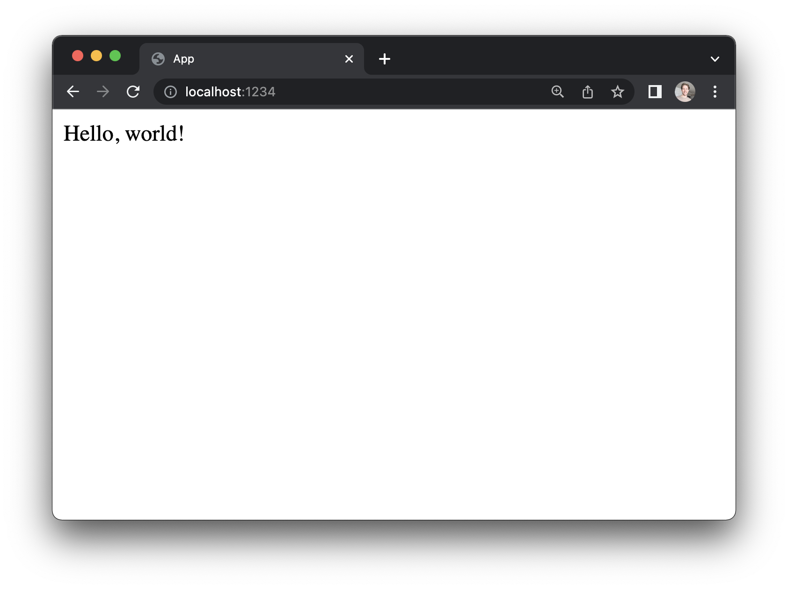

# Getting started

## Prerequisites

- [Node.js v16 or higher](https://nodejs.org)
- A code editor like [VS code](https://code.visualstudio.com/)


## Your first project

You can get started with _Elm Land_ using the official CLI tool available on [NPM](https://npmjs.org/elm-land). Let's start by using the `elm-land init` command to create our first project:

<<< @/snippets/guide/init-input.sh

<code-group>
<code-block title="Terminal output">

<<< @/snippets/guide/init-output.txt

</code-block>
</code-group>


## Running the dev server

The _Elm Land_ CLI tool comes with a dev server built-in, so you can run your new project in the browser with the `elm-land server` command:

```sh
npx elm-land server
```

<code-group>
<code-block title="Terminal output">

```txt
🌈 Server ready at http://localhost:1234
```

</code-block>
</code-group>

Visiting [http://localhost:1234](http://localhost:1234) in your browser will show you your new web app!



### You did it! :tada:

That's "Hello world!", but your app might need more than just a friendly homepage. The next guide will show you how to use the CLI to add more pages. See you there!